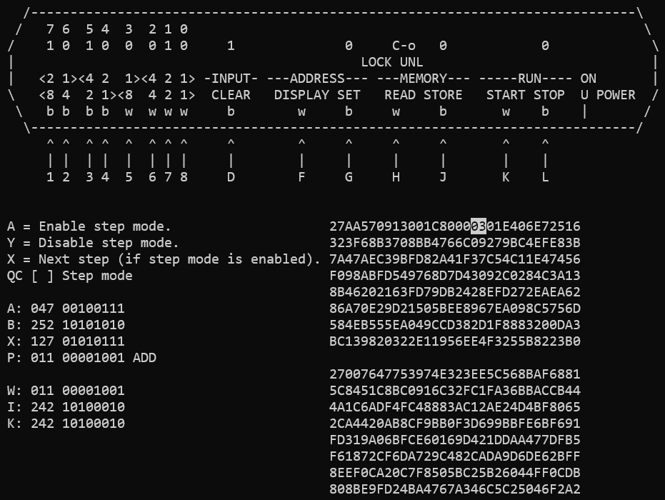

# RhinoKen - Kenbak-1 emulator

## About the Kenbak-1

The [Kenbak-1](https://en.wikipedia.org/wiki/Kenbak-1) is a computer by John
Blankenbaker, from **1971**(!).

What makes it so interesting?

- It predates the [home computer](https://en.wikipedia.org/wiki/Home_computer)
  revolution by several years (six!).

- The [Kenbak-1](https://en.wikipedia.org/wiki/Kenbak-1) is considered to be the
  world's first commercially available personal computer.

- It was made out of [TTL logic](https://en.wikipedia.org/wiki/Transistor%E2%80%93transistor_logic)
  ICs, without any kind of microprocessor (no
  [6502](https://en.wikipedia.org/wiki/MOS_Technology_6502), no
  [Z80](https://en.wikipedia.org/wiki/Zilog_Z80)).

- The 256 bytes of memory were integrated via two
  [serial shift registers](https://en.wikipedia.org/wiki/Shift_register) that
  "simulated"
  [delay line memory](https://en.wikipedia.org/wiki/Delay-line_memory).

- The whole computer had a
 [serial architecture](https://en.wikipedia.org/wiki/Bit-serial_architecture).

- The
  [official documentation](https://www.kenbak1registry.com/en/documents.html) is
  high quality, it includes complete schematics, a state diagram, detailed
  explanations of the inner workings, example programs and a programming
  tutorial.

- The whole thing was more or less a very impressive "one man show" by
  [John Blankenbaker](https://www.kenbak-1.net/)!

## About this emulator

There are a bunch of emulators and rebuilds of the
[Kenbak-1](https://en.wikipedia.org/wiki/Kenbak-1) available.

What does this implementation offer?

- It is based on the **state machine** from the official
  documentation by John Blankenbaker.

- **RhinoKen** is written in C, only. It is therefore highly portable (e.g., I
  made a kind-of replica, based on an
  [ESP-32](https://en.wikipedia.org/wiki/ESP32) microcontroller).

- This repository includes a `main.cpp` with a simple terminal-based user
  interface for the Windows operating system (simple to port to e.g. Linux).

- A simple assembler is included, state is *work-in-progress*.

- The emulator implementation is kind of "educational", there are a lot of infos
  from the official documentation of the
  [Kenbak-1](https://en.wikipedia.org/wiki/Kenbak-1) included in the code.
